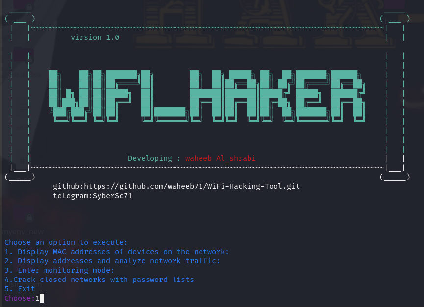
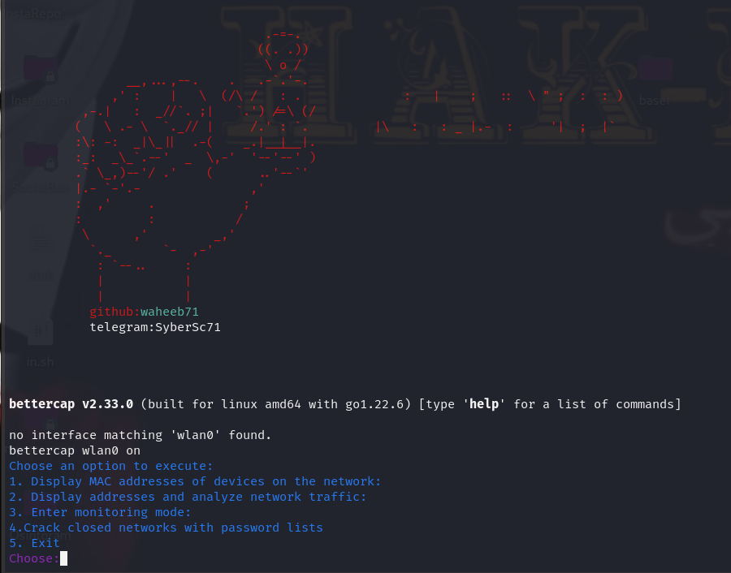
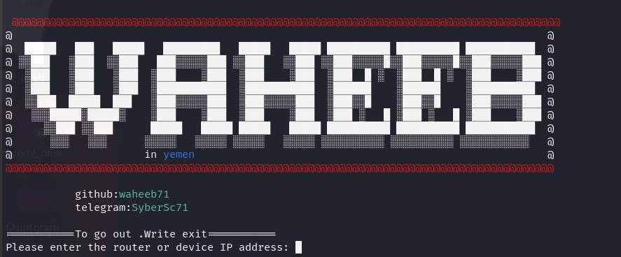
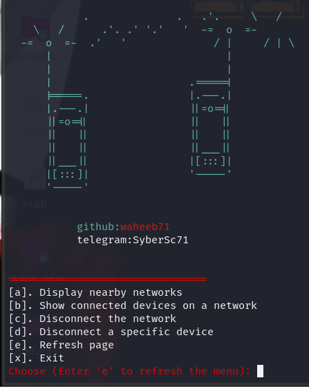
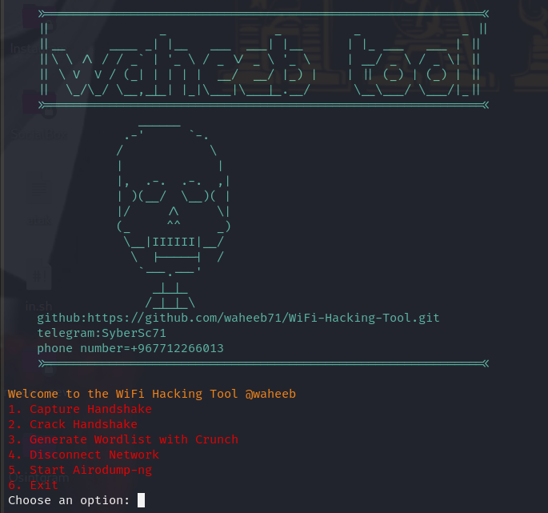

WiFi Hacking Tool is a powerful Python-based tool designed for ethical hacking and network analysis. It provides a user-friendly interface to capture handshakes, crack passwords, analyze network traffic, and perform various network attacks.

### 🌟 Features:
- **Handshake Capture:** Capture WPA/WPA2 handshakes from target networks.
- **Password Cracking:** Use wordlists or custom dictionaries to crack captured handshakes.
- **Network Monitoring:** Enter monitor mode and analyze nearby networks.
- **Deauthentication Attacks:** Disconnect devices from a network or target specific devices.
- **Traffic Analysis:** Analyze network traffic using BetterCAP.
- **User-Friendly Interface:** Easy-to-navigate menu for selecting different functionalities.

### 🛠️ Requirements:
- **Operating System:** Kali Linux or any Debian-based distribution.
- **Python Version:** Python 3.x
- **Required Packages:**
  - `bettercap`
  - `aircrack-ng`
  - `iw`
  - `termcolor`
  - `subprocess`


### 📦 Installation:
### Step 1: Clone the Repository
```bash
git clone https://github.com/waheeb71/WiFi-Hacking-Tool.git
cd WiFi-Hacking-Tool
```

### Step 2: Install Dependencies
Run the following command to install the required packages:
```bash
sudo apt update
sudo apt install bettercap aircrack-ng iw python3-pip
pip3 install termcolor
```

### Step 3: Run the Tool
```bash
python3 wifi_hacker.py
```

## 📝 Usage:
1. **Capture Handshake:** Select option `1` to capture handshakes from nearby networks.
2. **Crack Passwords:** Use option `4` to crack captured handshakes with a wordlist.
3. **Monitor Networks:** Enter monitor mode using option `3`.
4. **Disconnect Devices:** Perform deauthentication attacks using options `5` or `6`.

## 📸 Screenshots:






## 🚨 Important Notes:
1. **Ethical Use Only:** This tool should only be used for educational and ethical purposes. Do not attempt to hack into networks without explicit permission.
2. **Local Laws:** Ensure that your use of this tool complies with local laws in your country.
3. **Test on Your Own Network:** Always test the tool on your own network or networks where you have explicit permission to conduct tests.

## 📜 Disclaimer:
This tool is intended for educational and ethical purposes only. Unauthorized use of this tool on networks you do not own is illegal. The developer is not responsible for any misuse of this tool.

## 📞 Contact:
For questions or support, contact me via:
- Telegram: [@SyberSc71](https://t.me/SyberSc71)
- Telegram: [@WAT4F](https://t.me/WAT4F)
- GitHub: [waheeb71](https://github.com/waheeb71)
- **Location:** I am from Yemen, Taiz.
- **YouTube Channel:** [Cyber Code](https://www.youtube.com/@cyber_code1)
- **X (formerly Twitter):** [@SyberSc](https://x.com/SyberSc)


---

**Stay ethical, stay legal, and happy hacking!** 🔒💻


أداة اختراق الواي فاي هي أداة قوية مبنية على لغة البايثون تم تصميمها لأغراض الاختراق الأخلاقي وتحليل الشبكات. توفر واجهة سهلة الاستخدام للتقاط المصافحات، كسر كلمات المرور، تحليل حركة المرور الشبكي، وتنفيذ هجمات متعددة على الشبكات.

## 🌟 الميزات:
- **التقاط المصافحات:** التقاط مصافحات WPA/WPA2 من الشبكات المستهدفة.
- **كسر كلمات المرور:** استخدام قوائم الكلمات أو القواميس المخصصة لكسر المصافحات الملتقطة.
- **مراقبة الشبكات:** الدخول في وضع المراقبة وتحليل الشبكات القريبة.
- **هجمات إلغاء المصادقة:** فصل الأجهزة عن الشبكة أو استهداف أجهزة معينة.
- **تحليل حركة المرور:** تحليل حركة المرور الشبكي باستخدام BetterCAP.
- **واجهة سهلة الاستخدام:** قائمة سهلة التنقل لاختيار الوظائف المختلفة.

## 🛠️ المتطلبات:
- **نظام التشغيل:** كالي لينكس أو أي توزيعة ديبيان.
- **إصدار البايثون:** Python 3.x
- **الحزم المطلوبة:**
   `bettercap`   -
   `aircrack-ng` -
   `iw`          -
   `termcolor`   -
   `subprocess`  -


## 📦 التثبيت:

### الخطوة 1: استنساخ المستودع
```bash
git clone https://github.com/waheeb71/WiFi-Hacking-Tool.git
cd WiFi-Hacking-Tool
```

### الخطوة 2: تثبيت الحزم المطلوبة
قم بتشغيل الأمر التالي لتثبيت الحزم المطلوبة:
```bash
sudo apt update
sudo apt install bettercap aircrack-ng iw python3-pip
pip3 install termcolor
```

### الخطوة 3: تشغيل الأداة
```bash
python3 wifi_hacker.py
```

## 📝 كيفية الاستخدام:
1. **التقاط المصافحات:** اختر الخيار `1` للتقاط المصافحات من الشبكات القريبة.
2. **كسر كلمات المرور:** استخدم الخيار `4` لكسر المصافحات الملتقطة باستخدام قائمة الكلمات.
3. **مراقبة الشبكات:** ادخل وضع المراقبة باستخدام الخيار `3`.
4. **فصل الأجهزة:** قم بتنفيذ هجمات إلغاء المصادقة باستخدام الخيار `5` أو `6`.


## 🚨 ملاحظات هامة:
1. **الاستخدام الأخلاقي فقط:** يجب استخدام هذه الأداة لأغراض تعليمية وأخلاقية فقط. لا تحاول اختراق الشبكات دون إذن صريح.
2. **القوانين المحلية:** تأكد من أن استخدامك لهذه الأداة يتوافق مع القوانين المحلية في بلدك.
3. **اختبار على شبكتك الخاصة:** اختبر الأداة دائمًا على شبكتك الخاصة أو الشبكات التي حصلت على إذن صريح لإجراء الاختبارات عليها.
---
## 📜 إعلان تنصل:
هذه الأداة مخصصة للأغراض التعليمية والأخلاقية فقط. الاستخدام غير المصرح به لهذه الأداة على الشبكات التي لا تملكها غير قانوني. المطور غير مسؤول عن أي سوء استخدام لهذه الأداة.
---
## 📞 التواصل:
للأسئلة أو الدعم، يرجى التواصل معي عبر:
- تليجرام: [@SyberSc71](https://t.me/SyberSc71)
- تليجرام: [@WAT4F](https://t.me/WAT4F)
- جيت هاب: [waheeb71](https://github.com/waheeb71)
- **قناة اليوتيوب:** [Cyber Code](https://www.youtube.com/@cyber_code1)
- **حسابي على منصة إكس (تويتر سابقًا):** [@SyberSc](https://x.com/SyberSc)


- **الموقع:**  اليمن، تعز.

## 📜 الترخيص:
هذا المشروع مرخص بموجب ترخيص MIT. يرجى مراجعة الملف [LICENSE](LICENSE.md) للتفاصيل.

---

**ابق أخلاقيًا، ابق قانونيًا، واستمتع بالاختراق!** 🔒💻


